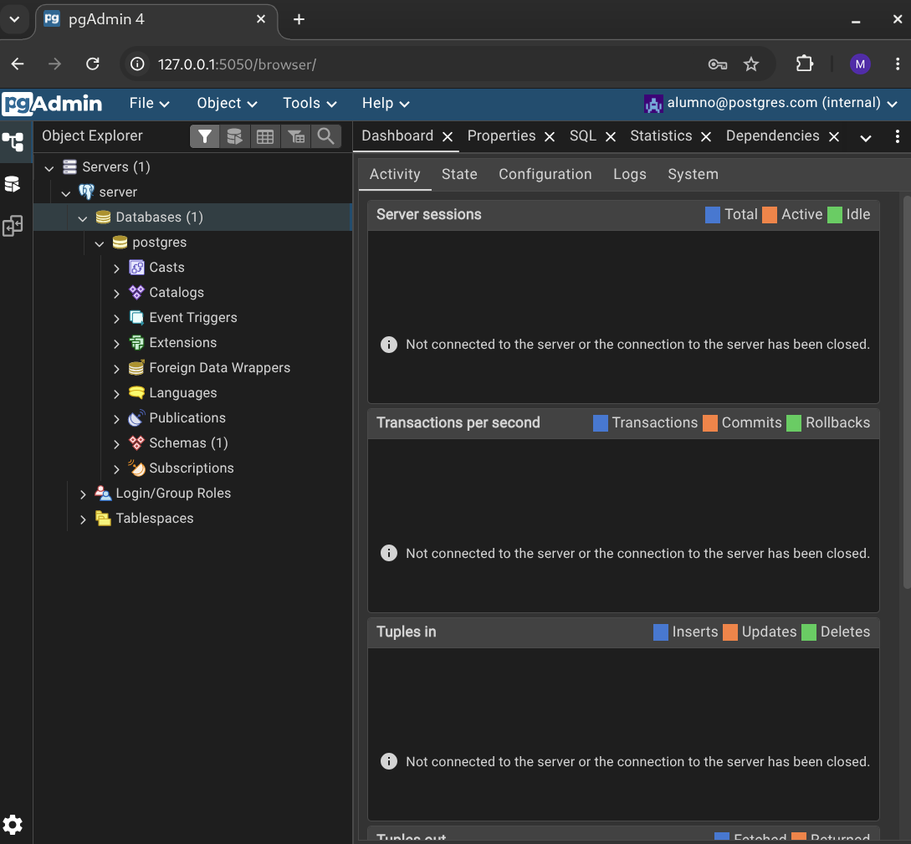

# Laboratorio PostgreSQL con GitHub Codespaces

Este laboratorio permite trabajar con PostgreSQL y pgAdmin directamente desde el navegador, sin necesidad de instalar software en el computador.

## Requisitos

* Cuenta de GitHub.
* Acceso a GitHub Codespaces.

---

## 1. Crear una copia del repositorio

Haz clic en **Fork** para crear una copia del repositorio en tu cuenta de GitHub.

---

## 2. Crear el Codespace

1. Abre tu fork del repositorio.
2. Haz clic en **Code**.
3. Selecciona la pestaña **Codespaces**.
4. Haz clic en **Create codespace on main**.

La primera creación puede tardar algunos minutos mientras GitHub prepara el entorno.

---

## 3. Abrir el Codespace

Cuando el entorno termine de iniciar, se recomienda seleccionar:

**Open in Visual Studio Code**

Esta opción suele ser más estable que la versión web cuando la carga inicial del navegador presenta problemas.

También puedes utilizar la versión web si prefieres trabajar completamente desde el navegador.

---

## 4. Abrir pgAdmin

1. En Visual Studio Code abre la pestaña **Ports**.
2. Busca el puerto etiquetado como **pgAdmin**.
3. Haz clic en **Open in Browser**.

No es necesario cambiar la visibilidad de los puertos a Público.

---

## 5. Iniciar sesión en pgAdmin

Utiliza las siguientes credenciales:

**Correo:**

```text
alumno@postgres.com
```

**Contraseña:**

```text
1234
```

---

## 6. Registrar el servidor PostgreSQL

La primera vez que ingreses a pgAdmin deberás registrar el servidor.

### Pestaña General

**Name**

```text
PostgreSQL Local
```

### Pestaña Connection

**Host name/address**

```text
postgres
```

**Port**

```text
5432
```

**Maintenance database**

```text
postgres
```

**Username**

```text
postgres
```

**Password**

```text
1234
```

Marca la opción:

```text
Save Password
```

y presiona **Save**.

---

## 7. Verificar la conexión

Si la configuración es correcta, aparecerá el servidor en el panel izquierdo de pgAdmin y podrás:

* Crear bases de datos.
* Crear tablas.
* Ejecutar consultas SQL.
* Administrar usuarios.
* Exportar e importar datos.

---

## Solución de problemas

### La página de pgAdmin no carga

1. Espera unos segundos y vuelve a intentarlo.
2. Verifica que el Codespace haya terminado de iniciarse.
3. Si utilizas la versión web y sigue fallando, abre el Codespace mediante **Open in Visual Studio Code** y vuelve a abrir el puerto desde la pestaña **Ports**.

### No puedo conectarme al servidor

Verifica que los datos sean exactamente:

```text
Host: postgres
Puerto: 5432
Usuario: postgres
Contraseña: 1234
```

No utilices:

```text
localhost
127.0.0.1
URLs públicas de Codespaces
```

ya que PostgreSQL se encuentra en un contenedor interno accesible mediante el nombre `postgres`.

---

## Credenciales del laboratorio

### pgAdmin

```text
Correo: alumno@postgres.com
Contraseña: 1234
```

### PostgreSQL

```text
Host: postgres
Puerto: 5432
Usuario: postgres
Contraseña: 1234
Base de datos: postgres
```

