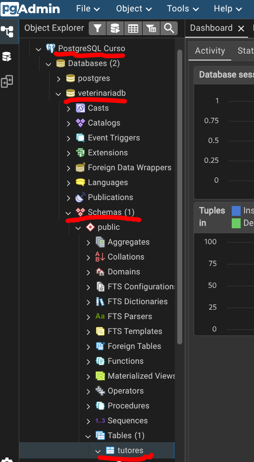

# Iniciar con GitHub Codespaces

Guía paso a paso para levantar el laboratorio de PostgreSQL + pgAdmin en GitHub Codespaces.
No necesitas instalar PostgreSQL ni pgAdmin: todo corre en la nube.

## Requisitos

* Cuenta de GitHub.
* Acceso a GitHub Codespaces.
* **[Visual Studio Code](https://code.visualstudio.com/) instalado** en tu computador. El
  laboratorio se abre con **Open in Visual Studio Code**, ya que iniciar el Codespace
  directamente en el navegador suele dar problemas (la carga y el inicio de sesión de pgAdmin
  fallan con frecuencia).

---

## 1. Crear una copia del repositorio

Haz clic en **Fork** para crear una copia de este repositorio en tu cuenta de GitHub.

>

---

## 2. Crear el Codespace

1. Abre tu fork del repositorio.
2. Haz clic en **Code**.
3. Selecciona la pestaña **Codespaces**.
4. Haz clic en **Create codespace on main**.

>

La primera creación puede tardar algunos minutos mientras GitHub prepara el entorno.

Al crear el Codespace, GitHub lo abrirá **automáticamente en el navegador**. Esta versión web
suele dar problemas (la carga inicial y el inicio de sesión de pgAdmin fallan con frecuencia),
así que **no trabajes aquí, cierra esa pestaña**: en el siguiente paso lo abriremos en Visual
Studio Code.

> **¿Qué es Codespaces?** — [Lee la documentación](CODESPACES.md)

---

## 3. Abrir el Codespace en Visual Studio Code

Aunque el Codespace se haya abierto en el navegador, ábrelo en la aplicación de escritorio,
que es mucho más estable:

1. En la pestaña del navegador, abre el menú (☰) en la esquina superior izquierda.
2. Selecciona **Open in Visual Studio Code**.
3. Acepta los avisos del navegador para abrir VS Code. La primera vez te pedirá instalar la
   extensión de Codespaces y autorizar la conexión.
4. Ya puedes **cerrar la pestaña del navegador** y seguir trabajando desde VS Code.

- 
- 
- 

> **¿Qué son Dev Containers?** — [Lee la documentación](DEVCONTAINER.md)

---

## 4. Abrir pgAdmin

1. En Visual Studio Code abre la pestaña **Ports**.
> 
2. Busca el puerto etiquetado como **pgAdmin**.
3. Haz clic en **Open in Browser**.

No es necesario cambiar la visibilidad de los puertos a Público.

> 

---

## 5. Iniciar sesión en pgAdmin

Utiliza las siguientes credenciales:

**Correo:**

```text
postgres@sql.dev
```

**Contraseña:**

```text
1234
```

> 

---

## 6. Conectarte al servidor (ya viene registrado)

**No necesitas registrar el servidor manualmente.** El entorno ya viene con el servidor
**PostgreSQL Curso** pre-configurado: aparece automáticamente en el panel izquierdo, bajo
**Servers**.

1. En el panel izquierdo, haz clic en **PostgreSQL Curso** para expandirlo.
2. pgAdmin te pedirá la contraseña la primera vez:

   ```text
   1234
   ```
3. Marca **Save Password** y presiona **OK**.

> 

> **¿El servidor no aparece?** Solo en ese caso necesitas registrarlo a mano:
> sigue la guía [Registrar el servidor manualmente](REGISTRAR_SERVIDOR.md).

---

## 7. Verificar la conexión y la base de datos de ejemplo

Al expandir el servidor verás, además de la base `postgres`, una base de datos de ejemplo
ya creada:

```text
veterinariadb
```

Trae la tabla **`tutores`** con 2 registros de ejemplo, lista para empezar a practicar de
inmediato. El resto de las tablas las irás creando tú en los ejercicios. Desde aquí puedes:

* Explorar la base `veterinariadb` (tablas, datos, relaciones).
* Crear tus **propias** bases de datos.
* Crear tablas y ejecutar consultas SQL.
* Administrar usuarios.
* Exportar e importar datos.

> 

---

## 8. Empezar los ejercicios

Todo listo. Abre el catálogo de ejercicios y empieza por el primer set:

> 👉 **[Ejercicios de PostgreSQL](../exercise/README.md)**

---

## Solución de problemas

### La página de pgAdmin no carga

1. Espera unos segundos y vuelve a intentarlo.
2. Verifica que el Codespace haya terminado de iniciarse.
3. Si utilizas la versión web y sigue fallando, abre el Codespace mediante **Open in Visual
   Studio Code** y vuelve a abrir el puerto desde la pestaña **Ports**.

### No puedo conectarme al servidor

Verifica que los datos sean exactamente:

```text
Host: postgres
Puerto: 5432
Usuario: postgres
Contraseña: 1234
```

No utilices:

```text
localhost
127.0.0.1
URLs públicas de Codespaces
```

ya que PostgreSQL se encuentra en un contenedor interno accesible mediante el nombre `postgres`.
