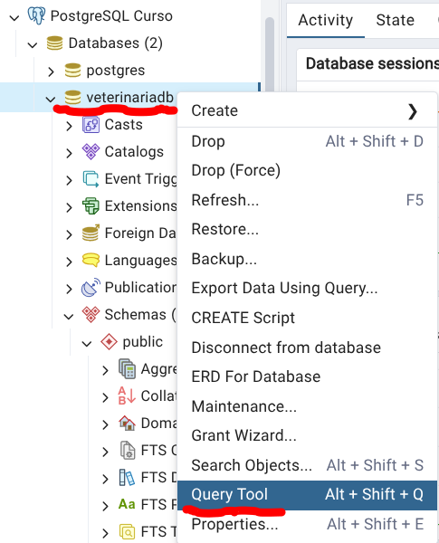

# Ejercicio 1 — Tu primera tabla: `tutores`

> 🎯 **Qué vas a aprender:** a **leer** (SELECT), **insertar** (INSERT) y **editar** (UPDATE)
> datos en una tabla que **ya existe**. No crearás nada todavía: solo trabajarás con datos.

La base de datos `veterinariadb` ya tiene creada la tabla **`tutores`** con 2 registros de
ejemplo. Un *tutor* es la persona dueña de una o varias mascotas.

> **Antes de empezar:** abre la herramienta de consultas.
> En pgAdmin, panel izquierdo → `Servers → PostgreSQL Curso → Databases → veterinariadb`,
> haz clic derecho → **Query Tool**. Ahí escribirás y ejecutarás el SQL (botón ▶ o `F5`).



---

## Paso 1.1 — Mira lo que ya existe (LEER)

Ejecuta esta consulta para ver los 2 tutores que vienen de ejemplo:

```sql
SELECT * FROM tutores;
```

Deberías ver algo así:

| id_tutor | nombre | telefono |
|---|---|---|
| 1 | Carlos Mendoza | 555-1234 |
| 2 | Ana Gómez | 555-5678 |

> 💡 `SELECT *` significa "muéstrame **todas** las columnas". El `*` es un comodín.

---

## Paso 1.2 — Agrega 2 tutores tuyos (INSERTAR)

Ahora te toca a ti. Inserta **2 tutores nuevos** con los nombres que quieras.

**Pista** — esta es la estructura de un `INSERT`:

```sql
INSERT INTO tutores (nombre, telefono) VALUES
('NOMBRE AQUÍ', 'TELÉFONO AQUÍ'),
('OTRO NOMBRE', 'OTRO TELÉFONO');
```

> 🔎 Fíjate que **no** escribimos el `id_tutor`: PostgreSQL lo genera solo (por eso es
> `SERIAL`). Tú solo das el nombre y el teléfono.

<details>
<summary>👀 Ver una solución de ejemplo</summary>

```sql
INSERT INTO tutores (nombre, telefono) VALUES
('Luis Martínez', '555-9012'),
('Sofía Rojas',   '555-3456');
```

</details>

---

## Paso 1.3 — Comprueba que se agregaron (LEER otra vez)

Vuelve a ejecutar:

```sql
SELECT * FROM tutores;
```

Ahora deberías ver **4 tutores** (los 2 de ejemplo + los 2 tuyos). 🎉
Acabas de ver tu progreso reflejado en la base de datos.

---

## Paso 1.4 — Edita un tutor por su nombre (EDITAR)

Cambia el **teléfono** del tutor llamado `Carlos Mendoza`.

**Pista** — la estructura de un `UPDATE`:

```sql
UPDATE tutores
SET telefono = 'NUEVO TELÉFONO'
WHERE nombre = 'NOMBRE DEL TUTOR';
```

> ⚠️ **El `WHERE` es obligatorio aquí.** Si lo olvidas, PostgreSQL cambiaría el teléfono de
> **TODOS** los tutores a la vez. El `WHERE` le dice "solo el que cumpla esta condición".

<details>
<summary>👀 Ver la solución</summary>

```sql
UPDATE tutores
SET telefono = '555-0000'
WHERE nombre = 'Carlos Mendoza';
```

</details>

---

## Paso 1.5 — Verifica el cambio (LEER)

```sql
SELECT * FROM tutores WHERE nombre = 'Carlos Mendoza';
```

El teléfono de Carlos debe mostrar el nuevo valor. ✅

---

## ✅ Lo que lograste

* **SELECT** → leer datos de una tabla.
* **INSERT** → agregar filas nuevas.
* **UPDATE ... WHERE** → modificar filas existentes sin tocar las demás.
* Entendiste que `SERIAL` genera el `id` automáticamente.

> 📤 **Entrega:** guarda tus `INSERT` y el `UPDATE` en `paso1.sql` y una captura de
> `SELECT * FROM tutores;` con tus datos. Recuerda: **uno de los tutores debe llevar tu propio
> nombre y apellido**. Dónde ubicar los archivos: [Entrega](ENTREGA.md).

➡️ **Siguiente:** en el [Ejercicio 2](paso2.md) crearás **tú mismo** la segunda tabla
(`mascotas`) y aprenderás a **relacionarla** con `tutores` usando claves foráneas.
